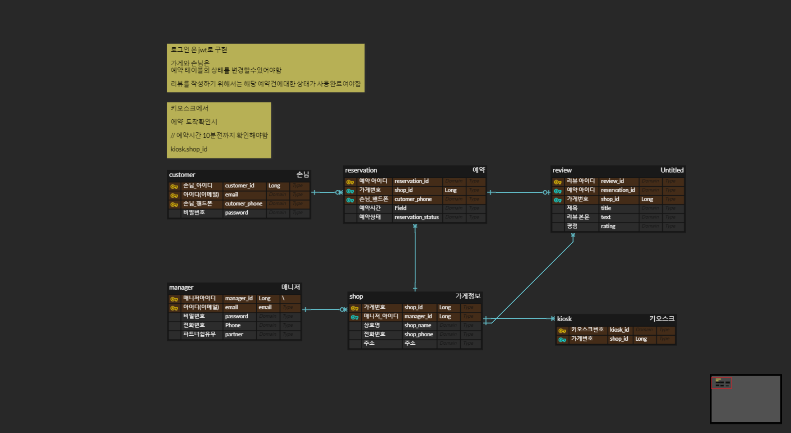

# 예약 프로그램 (Rest Api)

스프링부트를 이용한 예약 어플리케이션

swagger 로 api명세를 작성하였습니다. 실행후 서버주소/swagger-ui/index.html 를통해 확인할수있습니다.

해당 내용은 notion에서도 확인할수 있습니다. <a href="https://feelingxd.notion.site/Reservation-c14d3cd3490f4d6d97eb43a052ff7b58"> 노션링크</a>
## 개발환경 🔨

- JDK(11)
- Intellij
- gradle(build)
- Docker(DB 서버)
- Mysql

## 사용라이브러리📚

- Springboot: 2.7.10v
- Springboot-starter-web
- Springboot-starter-data-jpa
- SpringBoot-starter-validation
- lombok
- jjwt -lib (json web token 구현)
- swagger3
- mysql
- h2database(test 환경)

## ERD 📋

## 설명

공통: 

고객, 매니저는 회원가입과 회원가입을 할수있습니다. 로그인에대한검증은 jwt을 사용합니다.

가게: 

공통:

GET : /shop : 상점 목록을 가져옵니다.

/shop/{type} : 을 통해 정렬해서 가져올수있습니다.

type: 

RATE: 평점

NAME: 이름

매니저 : 상점을 등록 /삭제할수있으며 JWT를 통해 권한을  검증합니다.

고객:

고객은 자신의 예약사항과 예약상태를 확인할수있습니다.

예약 :  shop_id를 통해 예약 을할수있습니다. (매니저의 승인이 필요합니다.)

예약취소 : 고객읜 자신의 예약번호를 통해 예약을 취소할수있습니다.

매니저:

매니저는 자신의 가게의 예약을 조회할수있습니다. (모든 가게)

- 추가적으로 rservation_status 에 조회를 할수있습니다.
    
    type:
    
    `WAITING_FOR_APPROVAL("승인 대기"),`
    
    `RESERVATION_COMPLETE("예약 완료"),`
    
    `CUSTOMER_CANCEL("예약 취소 됨"),`
    
    `RESERVATION_REJECTED("예약 거부됨"),`
    
    `USE_COMPLETE("사용 완료"),`
    
    `UNAVAILABLE("사용 불가"),`
    
    `REVIEW_COMPLETE("리뷰 작성됨");`
    

파트너쉽을 가입해야 상점을 등록할수있습니다. ( 제약조건은 없습니다.)

매니저는 예약번호에대한 예약을 승인할수있습니다.

매니저는 예약번호에대한 예약을 거절할수있습니다.

키오스크:

kiosk_id 는 각 키오스크의 endpoint 나 propertie로 제공되는것을 전제로 작성했습니다.

매니저 : 자신의 가게에 키오스크를 추가할수있습니다.

고객 : 전화번호로 예약을확인하고 사용합니다. 예약시간 (10분전에 도착하여 확인해야합니다.)

- 10분 이후 확인시 사용불가 처리됩니다.
